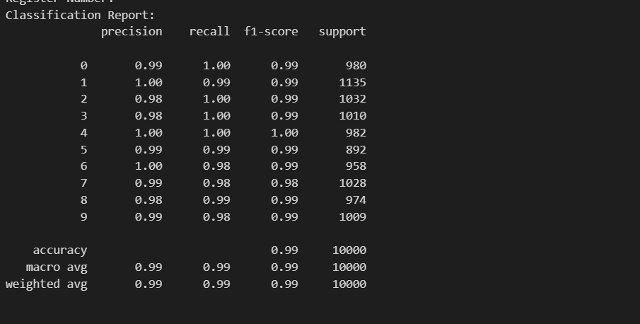
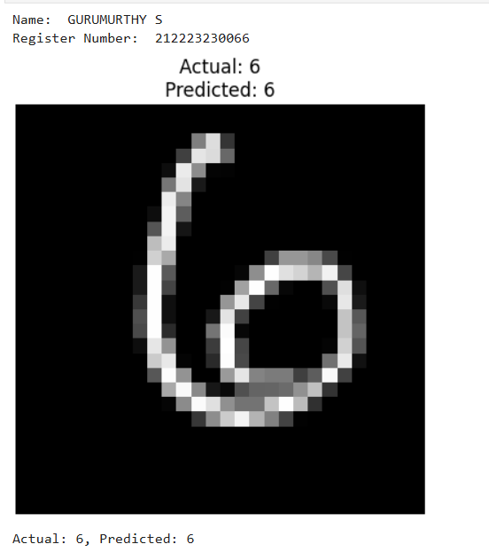

# DL-Convolutional Deep Neural Network for Image Classification

## AIM
To develop a convolutional neural network (CNN) classification model for the given dataset.

## THEORY
The MNIST dataset consists of 70,000 grayscale images of handwritten digits (0-9), each of size 28×28 pixels. The task is to classify these images into their respective digit categories. CNNs are particularly well-suited for image classification tasks as they can automatically learn spatial hierarchies of features through convolutional layers, pooling layers, and fully connected layers.

## Neural Network Model
```
Input: 28x28 grayscale image
   │
Conv2D: 32 filters, 3x3 kernel, ReLU
   │
MaxPool2D: 2x2
   │
Conv2D: 64 filters, 3x3 kernel, ReLU
   │
MaxPool2D: 2x2
   │
Flatten
   │
Fully Connected: 128 neurons, ReLU
   │
Dropout: 0.5
   │
Fully Connected: 10 neurons (output), Softmax

```
---

## DESIGN STEPS

### STEP 1: Import Required Libraries
- PyTorch for building and training the model
- torchvision for loading MNIST dataset
- matplotlib for visualization

### STEP 2: Load and Preprocess the Dataset
- Normalize pixel values to [0, 1]
- Split into training and test sets
- Use DataLoader for batching

### STEP 3: Build the CNN Model
- Define convolutional, pooling, and fully connected layers
- Implement forward pass using ReLU activations

### STEP 4: Define Loss Function and Optimizer
- Use `CrossEntropyLoss` for multi-class classification
- Use `Adam` optimizer for faster convergence

### STEP 5: Train the Model
- Loop through epochs and batches
- Compute loss and update weights
- Track training loss

### STEP 6: Evaluate Model Performance
- Test on unseen data
- Plot **confusion matrix** and compute **classification report**
- Predict on new sample images

---
## PROGRAM

### Name: Gurumurthy S

### Register Number: 212223230066
 
```python
import torch
import torch.nn as nn
import torch.optim as optim
import torchvision
import torchvision.transforms as transforms
from torch.utils.data import DataLoader
import matplotlib.pyplot as plt
import numpy as np
from sklearn.metrics import confusion_matrix, classification_report
import seaborn as sns
```

```python

## Step 1: Load and Preprocess Data
# Define transformations for images
transform = transforms.Compose([
    transforms.ToTensor(),          # Convert images to tensors
    transforms.Normalize((0.5,), (0.5,))  # Normalize images
])
```

```python

# Load MNIST dataset
train_dataset = torchvision.datasets.MNIST(root="./data", train=True, transform=transform, download=True)
test_dataset = torchvision.datasets.MNIST(root="./data", train=False, transform=transform, download=True)
```

```python

# Get the shape of the first image in the training dataset
image, label = train_dataset[0]
print("Image shape:", image.shape)
print("Number of training samples:", len(train_dataset))
```

```python

# Get the shape of the first image in the test dataset
image, label = test_dataset[0]
print("Image shape:", image.shape)
print("Number of testing samples:", len(test_dataset))
```

```python
# Create DataLoader for batch processing
train_loader = DataLoader(train_dataset, batch_size=32, shuffle=True)
test_loader = DataLoader(test_dataset, batch_size=32, shuffle=False)
```

```python
class CNNClassifier(nn.Module):
    def __init__(self):
        super(CNNClassifier, self).__init__()
        self.conv1 = nn.Conv2d(1, 32, kernel_size=3, padding=1)
        self.pool = nn.MaxPool2d(2, 2)
        self.conv2 = nn.Conv2d(32, 64, kernel_size=3, padding=1)
        self.fc1 = nn.Linear(64 * 7 * 7, 128)
        self.fc2 = nn.Linear(128, 10)
        self.dropout = nn.Dropout(0.3)
        self.relu = nn.ReLU()

    def forward(self, x):
        x = self.relu(self.conv1(x))
        x = self.pool(x)
        x = self.relu(self.conv2(x))
        x = self.pool(x)
        x = x.view(-1, 64 * 7 * 7)   # flatten
        x = self.relu(self.fc1(x))
        x = self.dropout(x)
        x = self.fc2(x)
        return x
```

```python
from torchsummary import summary

# Initialize model
model = CNNClassifier()

# Move model to GPU if available
if torch.cuda.is_available():
    device = torch.device("cuda")
    model.to(device)

# Print model summary
print('Name:  GURUMURTHY S')
print('Register Number:  212223230066')
summary(model, input_size=(1, 28, 28))
```

```python
# Select device (GPU if available, else CPU)
device = torch.device("cuda" if torch.cuda.is_available() else "cpu")
print("Using device:", device)

# Initialize model, loss function, optimizer
model = CNNClassifier().to(device)
criterion = nn.CrossEntropyLoss()
optimizer = optim.Adam(model.parameters(), lr=0.001)
```

```python
def train_model(model, train_loader, num_epochs=5):
    for epoch in range(num_epochs):
        model.train()
        running_loss = 0.0

        for images, labels in train_loader:
            images, labels = images.to(device), labels.to(device)

            optimizer.zero_grad()
            outputs = model(images)
            loss = criterion(outputs, labels)
            loss.backward()
            optimizer.step()

            running_loss += loss.item()
            print('Name:  GURUMURTHY S')
            print('Register Number:  212223230066')
        
        print(f'Epoch [{epoch+1}/{num_epochs}], Loss: {running_loss/len(train_loader):.4f}')
```

```python

# Train the model
train_model(model, train_loader, num_epochs=10)
```

```python
## Step 4: Test the Model
def test_model(model, test_loader):
    model.eval()
    correct = 0
    total = 0
    all_preds = []
    all_labels = []

    with torch.no_grad():
        for images, labels in test_loader:
            if torch.cuda.is_available():
                images, labels = images.to(device), labels.to(device)

            outputs = model(images)
            _, predicted = torch.max(outputs, 1)
            total += labels.size(0)
            correct += (predicted == labels).sum().item()
            all_preds.extend(predicted.cpu().numpy())
            all_labels.extend(labels.cpu().numpy())

    accuracy = correct / total
    
    print('Name:  GURUMURTHY S')
    print('Register Number:  212223230066')
    print(f'Test Accuracy: {accuracy:.4f}')
    # Compute confusion matrix
    cm = confusion_matrix(all_labels, all_preds)
    plt.figure(figsize=(8, 6))
    print('Name:  GURUMURTHY S')
    print('Register Number:  212223230066')
    sns.heatmap(cm, annot=True, fmt='d', cmap='Blues', xticklabels=test_dataset.classes, yticklabels=test_dataset.classes)
    plt.xlabel('Predicted')
    plt.ylabel('Actual')
    plt.title('Confusion Matrix')
    plt.show()
    # Print classification report
    print('Name:  GURUMURTHY S')
    print('Register Number:  212223230066')
    print("Classification Report:")
    print(classification_report(all_labels, all_preds, target_names=[str(i) for i in range(10)]))
```

```python

# Evaluate the model
test_model(model, test_loader)
```

```python

## Step 5: Predict on a Single Image
def predict_image(model, image_index, dataset):
    model.eval()
    image, label = dataset[image_index]
    if torch.cuda.is_available():
        image = image.to(device)

    with torch.no_grad():
        output = model(image.unsqueeze(0))
        _, predicted = torch.max(output, 1)

    class_names = [str(i) for i in range(10)]

    
    print('Name:  GURUMURTHY S')
    print('Register Number:  212223230066')
    plt.imshow(image.cpu().squeeze(), cmap="gray")
    plt.title(f'Actual: {class_names[label]}\nPredicted: {class_names[predicted.item()]}')
    plt.axis("off")
    plt.show()
    print(f'Actual: {class_names[label]}, Predicted: {class_names[predicted.item()]}')

```

```python

# Example Prediction
predict_image(model, image_index=80, dataset=test_dataset)
```


### OUTPUT

## Training Loss per Epoch


## Confusion Matrix


## Classification Report




### New Sample Data Prediction




## RESULT
The CNN model successfully classified the MNIST handwritten digits with high accuracy (~99%). The training loss decreased steadily over epochs, the confusion matrix shows correct predictions for almost all digits, and the model can correctly predict new unseen samples.
